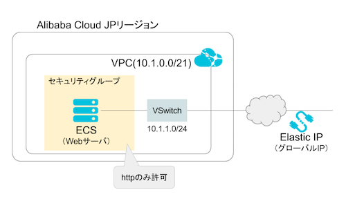
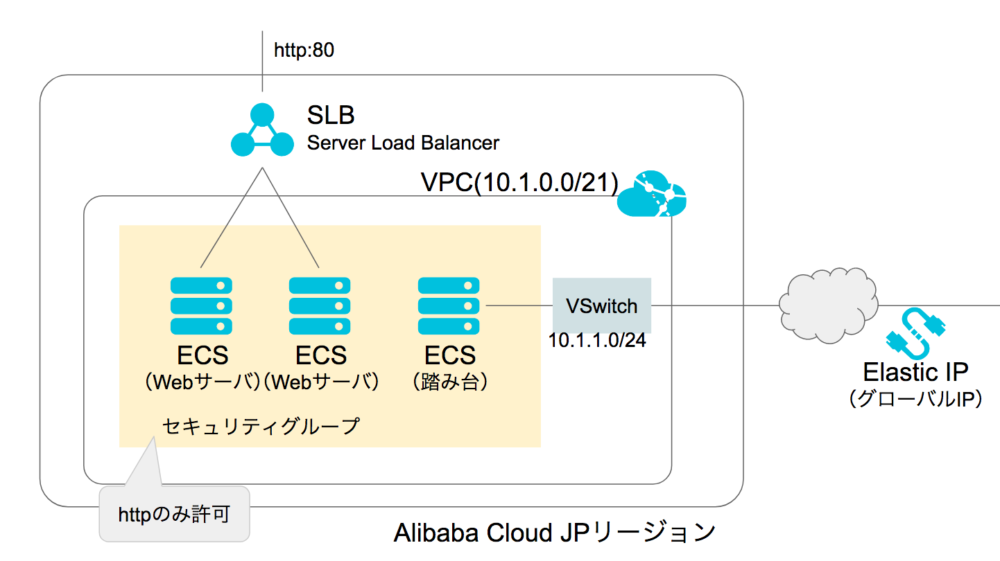
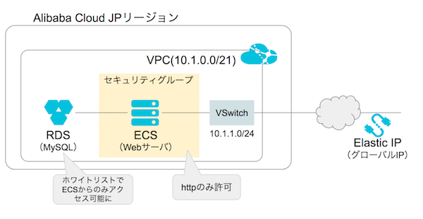

# Alibaba CloudのTerraformサンプル集
## 実行方法
基本的に下記の方法で実行可能です。
```
// 事前準備
$ cd baisc_sample // 実行したいサンプルへ移動
$ cp terraform.tfvars.sample terraform.tfvars
$ vim terraform.tfvars // API KEYなど必要情報更新

// Dry-Run
$ terraform plan -var-file="terraform.tfvars"

// クラウドへ反映
$ terraform apply -var-file="terraform.tfvars"

// 反映をデバッグログ残して実行したい
$ TF_LOG=TRACE TF_LOG_PATH=./terraform.log terraform apply -var-file="terraform.tfvars"

// 環境削除
$ terraform destroy -var-file="terraform.tfvars"
```

## basic_sample
VPCネットワーク内にECSインスタンスを作成し、作成したECSインスタンスに対し、EIPとセキュリティグループの設定をする基本サンプル。  
また、ユーザデータ機能を利用して稼働させるインスタンスには`httpd`をインストール起動している。



## basic_sample_with_ansible
basic_sampleと構成は同様。  
basic_sampleはユーザデータ機能でシェルスクリプトを用いてhttpdのインストールや起動を行っていた。  
この例では、ユーザデータ機能でAnsibleを実行させてhttpdのインストールや起動を実施。  
これにより、シェルスクリプトでは表現しづらい複雑な設定などに対応が可能になる。

## ansible_basic_sample
basic_sampleをベースにユーザデータ機能を利用して、ECSインスタンス内部でAnsibleを実行させる例。

## slb_sample
SLBを使った構成のサンプル。  
VPC内のWebサーバは、踏み台サーバを経由してインターネットに接続できるようにVRouterへのルーティング設定も行う。



## rds_sample
RDSを使った構成のサンプル。  
VPC内にWebサーバとRDSを構築。RDSへはWebサーバからのみアクセスできるようにホワイトリスト設定は。



## autoscaling_sample
AutoScalingを使った構成のサンプル。  
SLB配下のECSはAutoScalingにて作成。12-14時の間だけスケールする例を構築。

